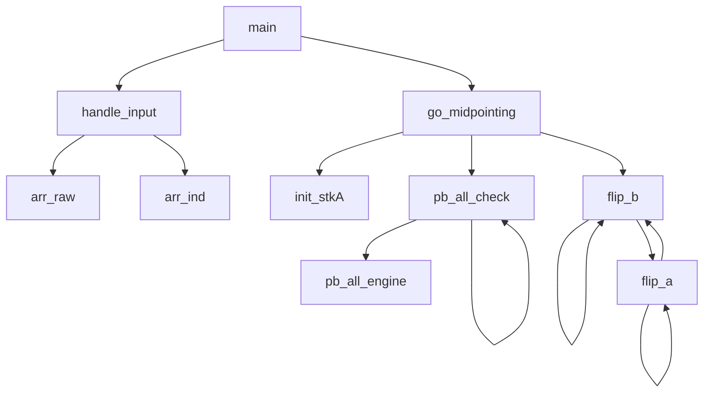

# push_swap
features the most complex project architecture in the core curriculum of 42 so far, as well as the following topics:
- an introduction to the topic of computational complexity
- stacks (the abstract notion)
- sorting values
- the learning and the subsequent unlearning of the sorting efficiency terminology
- sorting operations limitations

It also features 'getting next line' in the bonus part, which I hear might be a convenient segway into the pipex project.

## Available operations

The following operations all count as one step each, including the dual ones (ss, rr, rrr). One must sort a list of numbers using only these, but with some [relevant sidenotes](#being-limited-to-steps) regarding the topic of computational complexity. In the table below, the symbol `_` signifies where a moved element had previously been.

Beginning state | Operation applied | final state
----- | :------: | ------
a: 01234 <br> b: 56789 | sa <br> (swap a) | a: **10**234 <br> b: 56789
a: 01234 <br> b: 56789 | sb <br> (swap b) | a: 01234 <br> b: **65**789
a: 01234 <br> b: 56789 | ss <br> (swap a + swap b) | a: **10**234 <br> b: **65**789
a: 01234 <br> b: 56789 | pa <br> (push to a) | a: **5**01234 <br> b: _6789
a: 01234 <br> b: 56789 | pb <br> (push to b) | a: _1234 <br> b: **0**56789
a: 01234 <br> b: 56789 | ra <br> (rotate a) | a: _1234**0** <br> b: 56789
a: 01234 <br> b: 56789 | rb <br> (rotate b) | a: 01234 <br> b: _6789**5**
a: 01234 <br> b: 56789 | rr <br> (ra + rb) | a: _1234**0** <br> b: _6789**5**
a: 01234 <br> b: 56789 | rra <br> (reverse rotate a) | a: **4**0123_ <br> b: 56789
a: 01234 <br> b: 56789 | rrb <br> (reverse rotate b) | a: 01234 <br> b: **9**5678_
a: 01234 <br> b: 56789 | rrr <br> (revrot a + revrot b) | a: **4**0123_ <br> b: **9**5678_

________________________________________________

## Algorithm considerations
### Philosophy of efficiency
There is a discrepancy between what the assignment PDF describes and what the evaluation sheet evaluates, which initiates a journey of learning and subsequently ignoring the general terminology of computational complexity.
The assignment says:

> This project will make you sort data on a stack, with a limited set of instructions, using the lowest possible number of **actions**.

The word 'actions' does not actually refer to the elementary operations like the condition checks or any "pre-sorting" initialization steps on a copy of the list, but rather to the number of the authorized sorting actions only. Which frees the programmer to perform countless checks, but obfuscates the considerations of efficiency. Because ultimately, the evaluation sheet rates efficiency only according to the number of 'steps' performed. As an example for a list of 100 unsorted numbers:

- Less than 700 'steps': max score
- Just below 1500 'steps': min score
- Over 1500 'steps': fail


### Parameters?
Whether and how many parameters to keep track of or calculate dynamically will depend on how we approach the topic of algorithm efficiency i.e. computational complexity. But again, this project is not evaluated based on the elementary operations in the traditional sense of computational complexity. They are not accounted for at all. On a broad range of possible parameters, we could consider:
* The `largest number` / the `smallest number`
* The `previous largest number` / the `next smallest number`
* The `indexes` (values **0 2 8 11 13** being indexed as **0 1 2 3 4**)
* The `how many values smaller/greater than` the `current number`
* The `easy to reach positions` such as `pos_stk_a[0]`, `pos_stk_a[1]`, ... , `pos_stk_a[z - 1]`, `pos_stk_a[z]`/
* The `steps cost` for sorting a given number
* The `chunk size` if we divided the list into segments during sorting (relevant to a recursive approach)

### Being limited to 'steps'
One might find themself asking whether applying other, well-known and straight-forward sorting algorithms on a copy of the raw list initially would be fair game. Why would you want to do that? E.g. to know that **-1** and **8** are in fact consequent values in an ultimately sorted list, where the elements are {-42, -1, 8, 9, 22}. Personally I think it doesn't really matter whether you do it, because any computational strain of iterating over the stacks looking for the `thenextnumber` might turn out to be unnoticeable in real time, or the iteration might be optimized to perform other usefull services as well. However, after several discussions with peers, I decided to justify my slapping on of a bubble sort, thus creating an array of upward indexed values, by adhering to reducing the overall computational complexity, which ultimately is the project's topic, even if distantly.


## Project architecture

### My original project structure

```
push_swap: the "sort the smallest value permanently" approach

                                                                       ---arr_raw //malloc//
                      ---handle_input //check for errors, get size//---|
                      |                                                ---arr_ind //malloc//
                      |
main(argc, argv) -----|                 ---init_stk(a) //as linked list; malloc//
                      |                 |
                      |                 |
                      ---go_sorting-----|
                                        |   *while        ---conds_if_val_in_a --> do op, print, return
                                        |   (i < size)    |
                                        --- find_n_move---|
                                                          |
                                                          ---conds_if_val_in_b --> do op, print, return

* one by one, the next 'smallest' value is permanently sent to the bottom of stack A
```  
### My project structure after implementing the 'midpoint sort' algorithm



Notes on 'midpoint sort' flow:
- **handle_input**
  - parse the command line arguments
  - malloc for the two value arrays (raw and sorted (indexed))
  - error handling
  - indexing values by size (yup, pre-sorting)
- **init_stkA**
  - malloc for the linked list and assign the values from the **arr_raw**; the **arr_ind** is used for sortedness checks later on
- **pb_all_check** (a recursive function)
  - **pb_all_engine**:`pb` half of A (all values below a midpoint)
  - call **pb_all_check** again with a new (higher value) midpoint
- **flip_b** <-> **flip_a** two recursive functions calling themselves and eachother until *base case*
  - Note: they continously halve the sizes of each respective 'chunk' which they evaluate and bounce around via `pb` and `pa`

The concept of **chunk sizes** is crucial to minimizing the number of sorting operations, while symultaneously entirely omitting the need for evaluating the state of the entire stacks after each operation performed. Meaning no extensive structs or iterating over the entire chunks after each step are needed, which I think is quite elegant. However, I'm not gonna lie, I've spent 3 whole days tweaking the order of the recursive function calls and the exact 'chunk size' arguments passed to each one of them, and I'm still not sure that I confidently understand why I was unable to deal with those 'chunk size' calculations in a more succint and more legible way.


## The sorting algorithm

I first (1) used my own algorithm, then (2) tried to rewrite it by adding a pivot point and utilizing `ss`, `rr` and `rrr` a lot, but ultimately (3) implemented a recursive algorithm which the author has baptised *Midpoint sort*.

### 1. My original 'pa + ra' algorithm
I first devised my own sorting algorithm, which was ultimately passing the tests (barely). I was happy with it. Until I discovered the number-of-steps limitation for 500 numbers, which was 11500. My algorithm was taking 31000 steps to sort that many numbers. Here is how it worked.

We use `ra` to first send **smallest** and then keep sending larger and larger values to the bottom of the stack a, ensuring that `ra` == sorted
* Version 2.a.3 of my original algorithm:
**Note**: I was convinced by @nholbro to use linked lists as the data structure for sorting, rather than arrays. Which begs the question, how do you store information about the position (as in arr[pos]) in linked lists?
  * `int smallest`, `int next`, `step count`. Determine these, then store them in a struct.
  * You have smallest, now look at stacks. [`smallest` happens to be within reach]
    * Formalization of "if [`smallest` happens to be within reach]"
      * if `smallest` == a[0], then `ra`
      * else if `smallest` == a[1]
        * if `next` == a[0], then `sa` + `ra`
        * else `pb` + `ra`
      * else if `smallest` == a[z], then `0`
      * else if `smallest` == a[z - 1] && step == 0, then `rra`
      * else if `smallest` == b[0], then `pa` + `ra`
      * else if `smallest` == b[1]
        * if `next` == b[0], then `sb` + `pa` + `ra`
        * else `rb` + `pa` + `ra`
      * else if `smallest` == b[z], then `rrb` + `pa` + `ra`
      * else if `smallest` == b[z - 1], then `rrb` + `rrb` + `pa` + `ra`
      * **else** if `smallest` in **a**, then `pb`
      * **else** if `smallest` in **b**, then `rb` or `rrb`
        * add weigh: if b[pos] > size(b) / 2, then `rrb` until `smallest` is atop b
        * add weigh: if b[pos] <= size(b) / 2, then `rb` until `smallest` is atop b
  * Calculate new `smallest`, calculate new `next`. Double while loop. If (number being tested) !> `unsorted[i++]` then `smallest = (number being tested)`, else test next number from the array. rm it from `unsorted[]`.
  * You have smallest, now look at stacks. Atop **a** is not smallest, abottom **a** is smallest, atop **b** is nothing, abottom **b** is nothing. `pb` the 5 => a: _2431 b: **5**

An example of how it works:
  * **15243** => `ra` `pb` `ra` `sa` `ra` `ra` `pa` `ra` => **12345**
 
### 2. My new 'sifting' algorithm
This algorithm was meaning well and was going to maximize the utilization of `ss`, `rr` and `rrr` but I realized it would end up having similar shortcomings as my first one and was still not ready to accept that I needed to utilize extensive structs or that I needed to triple the number of conditions. So I opted for accepting that I needed recursion instead.

I never completed a sketch of this algorithm and it's for the best. I don't find the number of conditions triple the size of (1) a very appealing notion.

### 3. Midpoint sort

There seem to be similarities between 'Quick sort' and 'Midpoint sort'. However at this point the intertwining of multiple recursive functions seemed inevitable and I'd decided I needed guidance for that, so I've made my choice and relied on [this description of the algorithm](https://www.youtube.com/watch?v=7KW59UO55TQ&t=184s) by the author himself, which had the benefit of relating to the project directly. I find the 'Midpoint sort' to be quite impressive conceptually. Unfortunately however, a lack of examples in the video had me struggling with the implementation quite a bit. But I've somehow tamed the monster. First, (almost) everything is sent from A to B in a recursive function that functionally only ever returns into itself, so that's easy to deal with.

This function isn't part of 'flipping' the stacks or sending chunk halves back and forth between them, it's only in charge of sending (almost) all to stack B as a first step.
```C
void  pb_all_check(int *arr_ind, int size, t_list **stk_a, t_list **stk_b)
{
  int mid = size / 2;
  int rest = size - mid;

  // Base case:
  if (size <= 2)

  // Recursive case:
  pb_all_engine(arr_ind, mid, stk_a, stk_b);       // non-recursive, just sends all values below midpoint up to 'mid' times
  pb_all_check(&arr_ind[mid], rest, stk_a, stk_b); // recursive
  flip_b(arr_ind, mid, stk_a, stk_b);              // recursive
} 
```
Next, pb_all_check returns when there's only two values left in stk_a, and then flip_b is called for the first time, where `mid` is equal to 1 or 2 and is passed as an argument to flip_b to relay the `chunk size` to be considered in there.

```C
void  flip_b(int *arr_ind, int chunksz, t_list **stk_a, t_list **stk_b)
{
  mid = chunksz / 2;
  if (chunksz % 2 == 0)
    restsz = chunksz - mid + 1;
  else
    restsz = chunksz - mid;

  // Base case:
  if (chunksz <= 2)

  // Recursive case:
  pa_abovemid(&arr_ind[mid], chunksz - mid - 1, stk_a, stk_b);  // non-recursive
  flip_a(&arr_ind[mid + 1], chunksz - mid - 1, stk_a, stk_b);   // recursive
  flip_b(arr_ind, restsz, stk_a, stk_b);                        // recursive

  // pa_abovemid and its counterpart pa_belowmid are non-recursive. They just `pa` and `pb`
  // a number of elements above and below a given midpoint respectively.
}
```
Compare the recursive cases of flip_b and flip_a. Note that:
* flip_b is called from within flip_b to deal with the 'rest', i.e. the chunk values above and including the 'current' B pivot point
* flip_a is called from within flip_a to deal with the 'rest', i.e. the chunk values above and including the 'current' A pivot point
* also, somewhat surprisingly, notice the order in which flip_a and flip_b are called from within both functions - it's the same order

```C
void  flip_a(int *arr_ind, int chunksz, t_list **stk_a, t_list **stk_b)
{
  mid = chunksz / 2;
  restsz = chunksz - mid;

  // Base case:
  if (chunksz <= 2)

  // Recursive case:
  pb_belowmid(&arr_ind[mid], mid, stk_a, stk_b);  // non-recursive
  flip_a(&arr_ind[mid], restsz, stk_a, stk_b);    // recursive
  flip_b(arr_ind, mid, stk_a, stk_b);             // recursive
}
```


