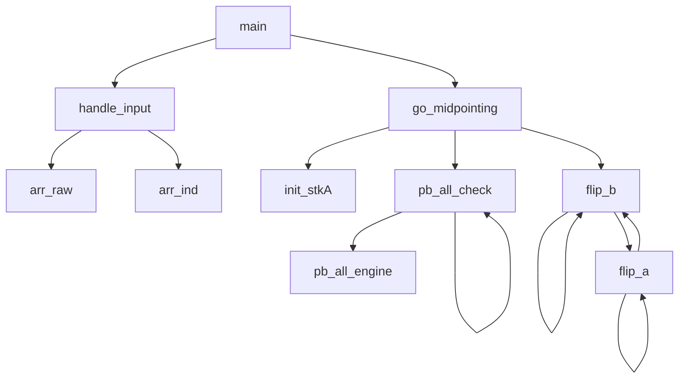

# push_swap
features the most complex project architecture in the core curriculum of 42 so far as well as the following topics:
- an introduction to the topic of computational complexity
- stacks (the abstract notion), sorting values
- the learning and the unlearning of the sorting efficiency terminology
- sorting operations limitations

It also features 'getting next line' in the bonus part, which might be a nice segway into the pipex project.

________________________________________________
## Available operations

Beginning state | Operation applied | final state
----- | :------: | ------
a: 01234 <br> b: 56789 | sa <br> (swap a) | a: **10**234 <br> b: 56789
a: 01234 <br> b: 56789 | sb <br> (swap b) | a: 01234 <br> b: **65**789
a: 01234 <br> b: 56789 | ss <br> (swap a + swap b) | a: **10**234 <br> b: **65**789
a: 01234 <br> b: 56789 | pa <br> (push to a) | a: **5**01234 <br> b: _6789
a: 01234 <br> b: 56789 | pb <br> (push to b) | a: _1234 <br> b: **0**56789
a: 01234 <br> b: 56789 | ra <br> (rotate a) | a: _1234**0** <br> b: 56789
a: 01234 <br> b: 56789 | rb <br> (rotate b) | a: 01234 <br> b: _6789**5**
a: 01234 <br> b: 56789 | rr <br> (ra + rb) | a: _1234**0** <br> b: _6789**5**
a: 01234 <br> b: 56789 | rra <br> (reverse rotate a) | a: **4**0123_ <br> b: 56789
a: 01234 <br> b: 56789 | rrb <br> (reverse rotate b) | a: 01234 <br> b: **9**5678_
a: 01234 <br> b: 56789 | rrr <br> (reverse rotate b) | a: **4**0123_ <br> b: **9**5678_

________________________________________________
a: 21543\
b: _____

- pb
  - a: 1543
  - b: 2
- pb
  - a: 543
  - b: 12
- ra
  - a: 435
  - b: 12
- pb
  - a: 35
 
________________________________________________

## Algorithm considerations
### Philosophy of efficiency
There is a discrepancy between what the assignment PDF describes and what the evaluation sheet evaluates, which initiates a journey of learning and subsequently ignoring the terminology of computational complexity.
The assignment says:
```
This project will make you sort data on a stack, with a limited set of instructions, using the <b>lowest possible number of actions</b>.
```
The word 'actions' does not actually refer to the operations like the condition checks or the pre-sorting initialization steps, but rather to the number of the authorized sorting actions only. Which frees the programmer to perform countless checks, but obfuscates the considerations of efficiency. Because ultimately, the evaluation sheet rates efficiency only according to the number of 'swaps' (authorized sorting steps) performed.
```
[For 100 unsorted numbers...]
- Less than 700 'steps': max score
- Below 1500 'steps': min score
- Over 1500 'steps': fail

```
### Parameters?
Whether and how many parameters to use will depend on whether keeping track of them would be considered to lower the algorithm efficiency. But if we had our hands untied, we could consider:
* The `largest number` / the `smallest number`
* The `indexes` (values **0 2 8 11 13** being indexed as **0 1 2 3 4**)
* The `how many values smaller than` the `current` 
* The `how many values greater than` the `current` 

**5096128347**

#### 2.a: scenario (a)
We use `ra` to first send **smallest** and then keep sending larger and larger values to the bottom of the stack a, ensuring that `ra` == sorted
* 2.a.1:
  * we `pb` until the smallest number comes on top of a, indicating that a is sorted so far.
  * we `rb` until we find `thenextnumber`? (assume we kept track)
  * we `pa` and `ra` and the next number is sorted. Now `thenextnumber++` happens.
* 2.a.2:
  * we `pb` until the smallest number comes on top of a, indicating that a is sorted so far.
  * we `rb` or `sb` or `rrb` depending which would get to `thenextnumber` more quickly. To find out, we iterated to look for it.
  * we `pa` and `ra` and the next number is sorted. Now `thenextnumber++` happens.
* 2.a.3 verbose:
  * **15243** => `ra` `pb` `ra` `sa` `ra` `ra` `pa` `ra`
  * **Note**: I was convinced by Natalie to used linked lists. Which begs the question, how do you store information about the position (as in arr[pos]) in linked lists?
  * `int smallest`, `int next`, `step count`. Calculate to determine and assign 1 as the smallest. rm from `unsorted[]`
  * You have smallest, now look at stacks. [`smallest` happens to be within reach] <- formalize conditions here. `ra` the `smallest` => a: _5243**1** b: _____
    * Formalization of "if [`smallest` happens to be within reach]"
      * if `smallest` == a[0], then `ra`
      * else if `smallest` == a[1]
        * if `next` == a[0], then `sa` + `ra`
        * else `pb` + `ra`
      * else if `smallest` == a[z], then `0`
      * else if `smallest` == a[z - 1] && step == 0, then `rra`
      * else if `smallest` == b[0], then `pa` + `ra`
      * else if `smallest` == b[1]
        * if `next` == b[0], then `sb` + `pa` + `ra`
        * else `rb` + `pa` + `ra`
      * else if `smallest` == b[z], then `rrb` + `pa` + `ra`
      * else if `smallest` == b[z - 1], then `rrb` + `rrb` + `pa` + `ra`
      * **else** if `smallest` in **a**, then `pb`
      * **else** if `smallest` in **b**, then `rb` or `rrb`
        * add weigh: if b[pos] > size(b) / 2, then `rrb` until `smallest` is atop b
        * add weigh: if b[pos] <= size(b) / 2, then `rb` until `smallest` is atop b
  * Calculate new `smallest`, calculate new `next`. Double while loop. If (number being tested) !> `unsorted[i++]` then `smallest = (number being tested)`, else test next number from the array. rm it from `unsorted[]`.
  * You have smallest, now look at stacks. Atop **a** is not smallest, abottom **a** is smallest, atop **b** is nothing, abottom **b** is nothing. `pb` the 5 => a: _2431 b: **5**
#### 2.b: scenario (b)
We use `pa` to first send **largest** and then keep sending smaller and smaller values to the top of the stack a, ensuring that `pa` == sorted
  - b: 412
- pb
  - a: 5
  - b: 3412
 
#### 3.0 The new 'sifting' algorithm
* While (++i < size) // so for five elements, we count to five, push those below the half to stk_b and perform additional ops if appropriate
  * init vip;
  * else if (pa0 < arr_ind[half])
    NOW ADJACENCIES FIRST:
    * if (pa0 - 1 == paz)
      * if
      * else
        * `rra`
    AND GENERAL SORTEDNESS AFTER:
    * if (pa1 < arr_ind[half]) && (pa0 > pa1)
      * if (pb0 < pb1)
        * `ss` + `pb`
      * else
        * `sa` + `pb`
    * else
      * `pb`

## Project architecture

### My original project structure

```
push_swap: the "sort the smallest value permanently" approach

                                                                       ---arr_raw //malloc//
                      ---handle_input //check for errors, get size//---|
                      |                                                ---arr_ind //malloc//
                      |
main(argc, argv) -----|                 ---init_stk(a) //as linked list; malloc//
                      |                 |
                      |                 |
                      ---go_sorting-----|
                                        |   *while        ---conds_if_val_in_a --> do op, print, return
                                        |   (i < size)    |
                                        --- find_n_move---|
                                                          |
                                                          ---conds_if_val_in_b --> do op, print, return

* one by one, the next 'smallest' value is permanently sent to the bottom of stack A
```  
### My project structure after implementing the 'midpoint sort' algorithm



Notes:
- **handle_input**
  - malloc for value arrays
  - error handling
  - indexing values by size (yup, pre-sorting)
- **init_stkA**
  - malloc for the linked list and assign the values from the **arr_raw**; the **arr_ind** is used for sortedness checks later on
- **pb_all_check** (a recursive function)
  - **pb_all_engine**:`pb` half of A (all values below a midpoint)
  - call **pb_all_check** again with a new (higher value) midpoint
- **flip_b** <-> **flip_a** two recursive functions calling themselves and eachother until *base case*
  - Note: they continously halve the sizes of each respective 'chunk' which they evaluate and bounce around via `pb` and `pa`

The concept of **chunk sizes** is crucial to minimizing the number of sorting operations, while entirely omitting the need for evaluating the state of the entire stacks after each operation performed. I'm not gonna lie, I've spent 5 days tweaking
